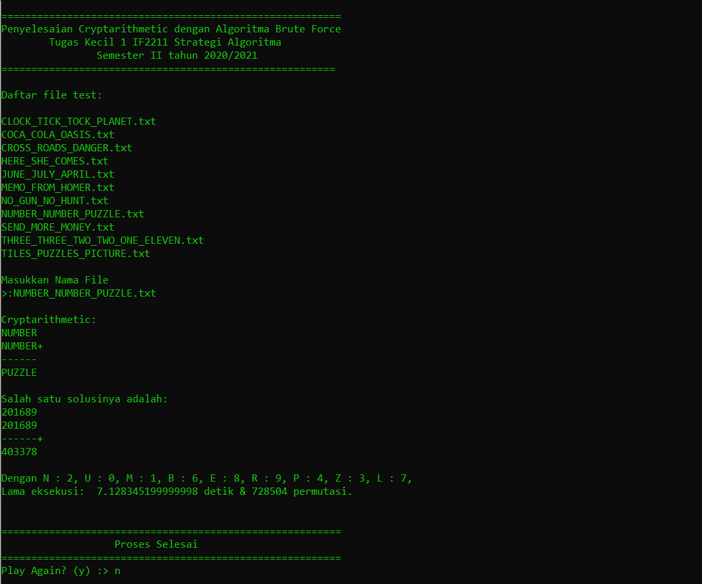

# Penyelesaian Cryptarithmetic dengan Algoritma Brute Force

## Deskripsi
Brute-force merupakan suatu jenis pendekatan penyelesaian masalah yang bersifat sederhana, jelas, dan juga langsung. Termasuk dalam persoalan cryptarithmetic dapat diselesaikan dengan menggunakan algoritma brute-force. Suatu solusi dari cryptarithmetic akan didapatkaan dengan mengiterasi setiap kemungkinan dari kombinasi huruf.

## Contoh Persoalan
   SEND         9567
   MORE         1085
-------+      ------+
  MONEY        10652

## Bahasa Pemrograman
Python 3

## Cara menggunakan program (file executable)
Masuk Ke folder bin
jalankan file CrypBruf.exe

## Cara menggunakan program (file python)
Masuk Kedalam termiminal dengan alamat file Tucil1_13519136 berada
Masuk ke folder src
jalankan file CrypBruf.py

## Menambahkan File Test
Untuk semua file test harus berada adalam folder test.
Apabila ingin menguji dengan file baru, file tersebut harus berada di folder test yang satu tingkat dengan folder src/bin.

## Spesifikasi file input
File teks yang berisi minimal empat baris. Baris pertama menyatakan operand pertama, baris kedua menyatakan operand kedua dan diakhiri dengan tanda tambah (+), baris ketiga menyatakan garis --------, dan baris keempat adalah hasil penjumlahan

## Contoh isi file teks:
 SEND
 MORE+
------
MONEY

## Contact
[Muhammad Rizal Muhaimin](https://github.com/MrizalMuhaimin)
NIM: 13519136

